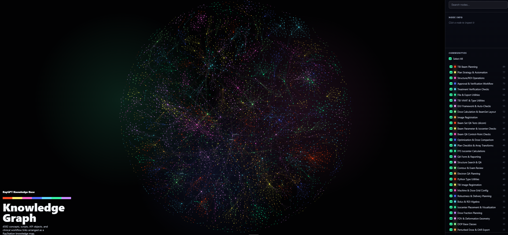

# RayStation Knowledge Graph

> A public knowledge graph for the RayStation / RayGPT ecosystem —  
> built for coding agents, researchers, and developers working in radiotherapy treatment planning.

<p align="center">
  
</p>

---

## What Is This?

This repository publishes a **knowledge graph** derived from the RayGPT codebase. It maps relationships, concepts, functions, and tools across the RayStation scripting ecosystem — with private source path metadata removed so it is safe to share and build on freely.

Whether you are onboarding to the RayStation scripting environment, building a coding agent, or exploring clinical workflow patterns, this graph gives you a structured and visual starting point.

---

## Repository Contents

| File | Description |
|------|-------------|
| `graph.json` | Machine-readable graph — load this into your coding agent |
| `graph.html` | Interactive browser visualization |
| `manifest.public.json` | Export metadata (version, creation date, node/edge counts) |
| `Figures/` | Screenshots and visual assets |

---

## Quick Start

### Option A — Clone the repository

```bash
git clone https://github.com/MustafaKadhim/RayStation_Knowledge_graph.git
cd RayStation_Knowledge_graph
```

### Option B — Download as ZIP

1. Click the green **Code** button at the top of this page.
2. Select **Download ZIP**.
3. Extract and open the folder in your editor.

---

## Explore the Graph in Your Browser

Launch a local static server from the repository root:

```bash
python3 -m http.server 8000
```

Then open your browser at:

```
http://localhost:8000/graph.html
```

Pan, zoom, and click nodes to explore relationships between scripts, functions, and clinical concepts interactively.

---

## Use with Your Coding Agent

Point your agent to `graph.json` and ask questions like:

```
"Load graph.json and list the top communities by node count."
"Find scripts or functions related to plan optimization and QA checks."
"Show all entities connected to CheckClinicalGoals.py."
"Which tools are involved in dose-volume histogram evaluation?"
```

The graph encodes entities, communities, and weighted edges — giving your agent rich relational context without needing access to the raw source code.

---

## Notes

This graph is designed for discovery and relationship mapping. It is an excellent complement to the official RayStation scripting documentation, but is not a replacement for it.

Feel free to extend the concept, adapt the pipeline, or contribute improvements.

---

<p align="center">
  Built with the <strong>RayGPT</strong> knowledge pipeline &nbsp;·&nbsp; Mustafa Kadhim
</p>
